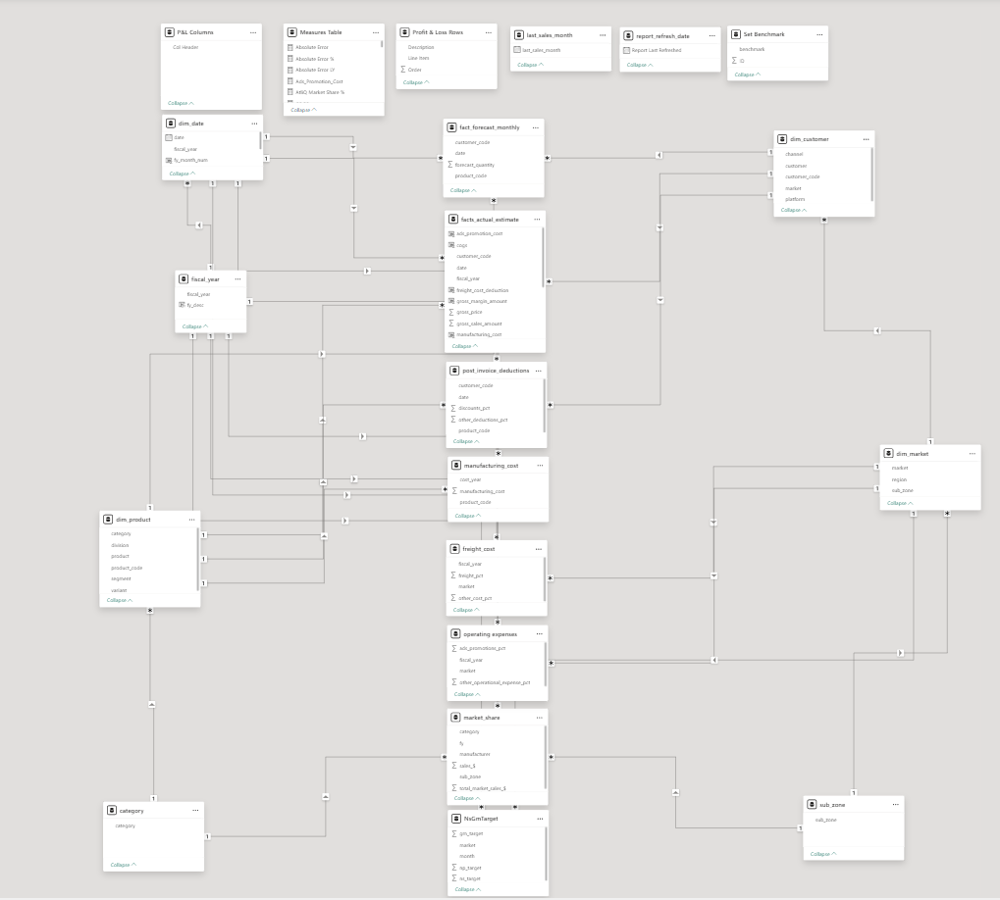
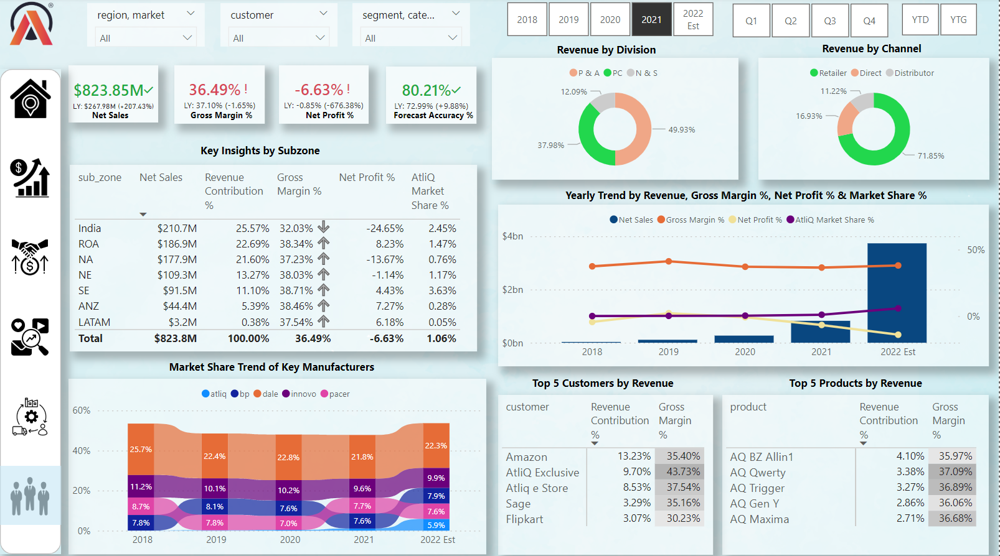
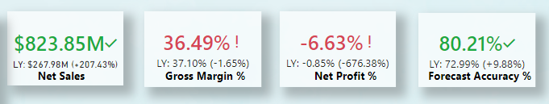
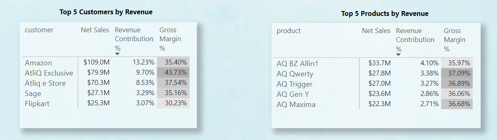
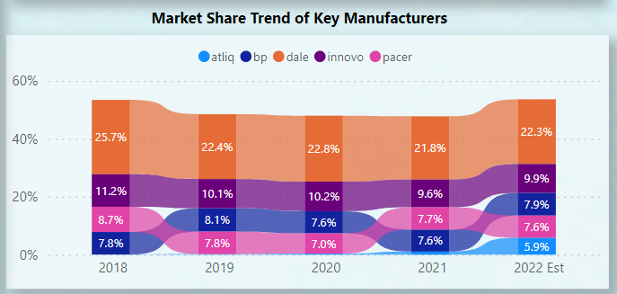
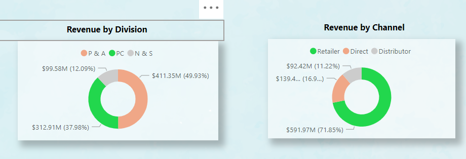
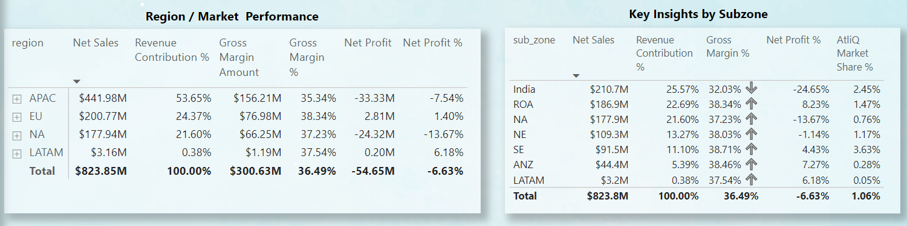

# AtliQ Business Insight Report
---
## Project Overview
AtliQ hardware is a rapidly growing company that manufactures PC, Accessories and peripherals, and in recent years, they have
decided to implement data analytics into their business process for the first time to enable them track trends, stay competitive and to make data driven decision.
## Objectives
The goal of this project is to create an interactive dashboard for various business stakeholders that displays revenue figures and performance of the company across different markets, industry, products and customers. 
## Key Qestions
1. Who are the company's top customers in terms of revenue generated?
2. What are the top performing products and least performing products in terms of revenue?
3. What has been the trend of the market share of the company over the years?
4. Which market is the company performing the most?
5. What is the demand forecast of the company in terms of forecast accuracy?
## Data Collection
The dataset used for this analysis contains over a million records with attributes such as "dim_customers", "dim_products", "dim_market", "facts_sales", "facts_forecast_sales" amongst others. These dataset was domiciled in MySQL database, and Power BI was connected to the database to extract the data, and then transformed and loaded in power query.
### Tools used:
- MySQL database: Data storage and validation
- Power BI: Extract, Transform, Load and performing exploratory analysis
## Data Cleaning & Preparation in Power Query
### Steps taken:
1. **Duplicate Removal:** some of the data contained duplicates which were eliminated
2. **Replacing value:** replaced some data fields due to spelling mistakes to ensure data integrity
3. **Change Data type:** applied the right data types for each of the columns in the table
4. **Join Operations:** applied the "merge query" function in power query to join multiple tables based on columns relationship
5. **Custom table:** created a date dimension table using M-language
### Outcome:
Cleaned and structured data, ready for analysis and visualization

## Data Modeling
Established relationship between key tables: dimension tables and the facts tables as seen below:



The data model is a star schema. There are 8 fact tables and 7 dimension tables. The dimension tables are all joined to the fact tables on a one-to-many relationship.

## DAX measures
Some of the DAX measures that was created are:
```dax
Net Sales = SUM(facts_actual_estimate[net_sales])

Net Sales LY = CALCULATE([Net Sales], SAMEPERIODLASTYEAR(dim_date[date]))

Revenue Contribution % = DIVIDE([Net Sales], CALCULATE([Net Sales], ALL(dim_customer), ALL(dim_market), ALL(dim_product)))
```
## Visualization and Analysis
The analysis was divided into 5 dashboard pages, with each pages targeting specific insights. You can interact with the report [here](https://app.powerbi.com/groups/me/reports/de7e81bb-1f17-4119-860f-99ba8dbca1ea/ReportSection?experience=power-bi)

### Page 1: Executive View

### Key Visuals:
**1. Key Performance Indicators Tiles:**
   
  
  
**Insights:** 
- The company recorded about $823 million in net sales/revenue in year 2021, when compared with previous year of $267 million which is a 207% increase year-on-year
- Recorded a gross margin of 36.49% in 2021, when compared with previous year at 37.1% which is a slight decrease due to high cost of gooods sold
- The company has been recording a negative net profit for years due to the business strategy of market penetration. The focus of the company is to gain enough market share and generate more revenue at the expense of profit.
- The forecast accuracy of the company which compares the actual sales and forecasted sales has been steadily increasing over the years, with the company recording 80.21% in 2021 when compared with 72.99% in previous years.
  
**Recommendation:** 
- While revenue growth is impressive, the slight decline in gross margin highlights the need to optimize cost of goods sold. Negotiate better supplier contracts and explore cost-saving measures to improve margins.
-  The negative net profit is a trade-off for market share growth. Reassess the timeline for transitioning to profitability and consider targeting high-margin customer segments to balance growth with sustainable profits
-  With an improved forecast accuracy of 80.21%, strengthen inventory management and resource allocation to minimize waste and better meet customer demand, reducing operating costs further.

**2. Customers and Product Performance:**
   
   

   **Insights:** 
   - The top 5 customers bringing the highest revenue are Amazon, AtliQ Exclusive, Atliq e Store, Sage and Flipkart with Amazon being the top customer that generated $109 million in 2021
   - The top 5 product bring the highest sales are AQ BZ Allin1, AQ Qwerty, AQ Trigger, AQ Gen Y and AQ Maxima with AQ BZ Allin 1 being the top product that generated $33 million in 2021.

  **Recommendation:**
- Prioritize strategic partnerships with top customers, especially Amazon, which contributed $109 million in revenue. Explore joint marketing campaigns and exclusive deals to deepen collaboration and drive mutual growth.
- Allocate resources to further develop, market, and optimize the top-selling product, AQ BZ Allin1, which generated $33 million. Introduce variations, bundle deals, or complementary products to maximize revenue potential.

**3. Market Share Performance:**

 

  **Insights:** 
 - AtliQ has demonstrated consistent growth in market share over recent years, increasing from a modest 0.1% in 2018 to 0.2% in 2019, 0.4% in 2020, and achieving 1.1% in 2021. Projections indicate a significant surge to 5.9% market share in 2022, showcasing the company's rapid market expansion and competitive positioning. Currently, AtliQ is still maintaining the 5th position in the industry.

  **Recommendation:**
- Leverage current strategies driving market share expansion, such as competitive pricing, targeted marketing, and product innovation.
- Increase brand awareness in underpenetrated markets to accelerate growth and solidify AtliQ’s position as a market leader.

**3. Business Division Performance:**

 
 
  **Insights:** 
  -  In 2021, the Peripheral & Accessories (P&A) division led the company’s revenue generation with an impressive $411.35 million, followed by the Personal Computer (PC) division at $312.91 million. The Networking & Storage (N&S) division contributed the least, recording $99.58 million in revenue.
  - In 2021, Retailers emerged as the top-performing sales channel, generating $591.97 million in revenue. This was followed by Direct-to-Consumer sales, which contributed $139.4 million, while the Distributor channel recorded the lowest revenue at $92.42 million.

 **Recommendation:**
 -  Peripheral & Accessories leading in the division, the company should invest in product innovation, marketing, and partnerships to maintain its competitive edge and capitalize on growing demand.
 -  PC division shows strong performance, hence, focus should be on introducing high-margin products, upgrading technology, and targeting emerging markets to increase revenue.
 -  The networking division requires strategic attention, the company can explore opportunities in cloud storage, smart networking solutions, and enterprise partnerships to boost its revenue contribution.
 -  Retailers channel generated the highest revenue, hence, focus should be on enhancing partnerships, offering exclusive deals, and providing better support to further boost sales through this channel.
 -  The Direct-to-Consumer channel shows potential for growth. The company should invest in digital marketing, e-commerce platform optimization, and personalized customer experiences to drive higher sales.
 -  With Distributor channel having the lowest performanc, the company should evaluate the distribution network, improve logistical support, and consider incentives for distributors to increase sales through this channel.

**4. Region/Market Performance:**

 

  **Insights:** 
  - In 2021, the Asia Pacific (APAC) region generated the highest profit, totaling $441.98 million, followed by the European Union (EU) with $200.77 million. The Latin America (LATAM) region recorded the lowest profit, amounting to $3.16 million.
  - Within the Asia Pacific region, India emerged as the top performer, generating $210 million in revenue. In contrast, the Latin America subzone recorded the lowest revenue, totaling $3.2 million.

**Recommendation:**
- Given that APAC generated the highest revenue ($441.98 million), continue to invest in this high-performing region through strategic partnerships, market expansion, and targeted marketing to maintain and grow its market share.
- With $200.77 million in revenue, the EU region is a strong contributor. Focus on further penetration into underdeveloped markets within the EU, while enhancing product offerings and customer engagement to boost revenue.
- The LATAM region generated the lowest profit ($3.16 million). Conduct a thorough market analysis to identify challenges and opportunities, optimize pricing strategies, and explore new distribution channels to drive growth in this underperforming region.
- With $210 million in revenue, India is a key performer in the Asia Pacific region. Focus on expanding product offerings, increasing local partnerships, and investing in marketing to further capitalize on the growing Indian market.
 


